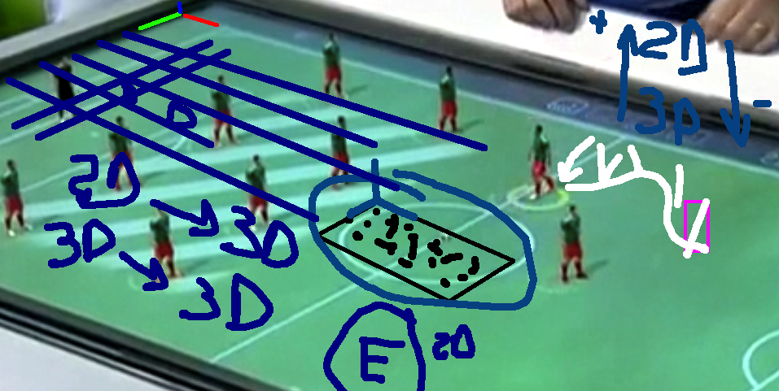

## Unidade 1
Conceitos Gerais: as Realidades ..
  denominação

Aplicações
Arquivos 
[my link](file:///Volumes/HD_APOIO/_RV_/Tecnologias/)

Realidade Virtual - recursos
  Realidade Virtual Imersiva (alto)
    Modelagem do Ambiente -> CG -> fotorealisco -> teste Turing (crível)
      Forma -> Fácil
      Aparência -> desgate "natural"
  
  Hibrido: mistura entre modelagem virtual recursos do mundo real

  TinyBop: exemplo de uso de cenas cartunizadas.
            Realidade Virtual não Imersiva -> simulação / jogos sérios
    APP: O Corpo ... uso da câmera para simular a imagem do fundo do olho

  saude: exemplos de imagens para sobrepror a cena real ... direitos autorais
    APP: Virtuali-tee (imagem site)
    TCC Danilo: http://dsc.inf.furb.br/arquivos/tccs/monografias/2018_1_danilo-conrado-eskelsen-junior_monografia.pdf

  RealidadeAumentada
    Vários:
IHC 
  IUT (Interface Usuário Tangível) -> 
--------    

[ ] Video no final da aula ___
Pre-Symposium (BR)	https://youtu.be/LU-LJUo6fyA	
    00:00:00	Abertura do Evento
    00:12:56	Conceitos sobre RV e RA (Romeu Tori)
		00:34:26	Aplicações de RV e RA em saúde
		00:56:31	Perguntas e respostas
		01:13:42	SVR | Break
		01:30:02	Deep Reinforcement Learning em Ambientes Virtuais
		01:53:28	Ecossistema XR no Brasil: desafios, oportunidades, ameaças e perspectivas
		02:12:00	Realidade Estendida em treinamentos corporativos
		02:23:00	Perguntas e respostas
		02:44:00	Encerramento

## Unidade 2 - Hardware (não tradional)
Comentar o que é a unidade 2
mostrar a atividade deles no AVA3
HMDs: Oculus Quest / RIFT / CardBoard
Data Glove (luvas de dados): tracking mãos (relativa) / tato
LeapMotion: tracking (absoluto)
Projeções (CAVES): 
Movimento "parado":

Mesa Tática: /Volumes/TM_Dalton/_Nuvem/OneDrive_FURB/__local/_disciplinas/disciplina-rv/disciplina-mm/Tecnologias/RealidadeAumentada/RealidadeAumentada_MesaTatil.mov

TCC de sinuca ...

Exemplo de mesa sinuca RM: /Volumes/TM_Dalton/_Nuvem/OneDrive_FURB/__local/_disciplinas/disciplina-rv/disciplina-mm/Tecnologias/Projetor-3D/Pool Live Aid  - Futurália, Lisboa.mp4

Super projeto de sinuca (robótica): https://www.youtube.com/watch?v=vsTTXYxydOE

LOD (Level Of Detail)

### Conteúdo

#### Dispositivos de E/P/S (sensores e atuadores) usados em RVs
Relembrar a importância do uso hardware em RV: slides c/ hardware rv-slides_u1a.key e rv-slides_u2a.key
Video curto no Teams/Equipe sobre Realidade Misturada (RM)

#### Espaços dimensionais e tipos de informações usadas em RVs
Entender os espaços dimensionais (Real/Virtual, 1D/2D/3D/4D ... ND)
Os tipos de informações: Raster / Vetorial

Precisa ter uma fase calibragem: manual / semi / automática
    1) achar o marcador (iluminação, simetria) escolha do marcador

A referência da informação: absoluta / relativa
Mundo Real 3D <- Mundo Virtual 3D
SRU 
Posição (X,Y,Z) -> translação
Orientação (2x ângulo) -> rotação
Proporção (ampliar/reduzir) -> escala
  Matriz de Transformação 4x4

  Tracking (rastreamento)
    Âncora: registro (processador dedicado ao movimento , mais câmeras) -> qualidade/resposta
      DOF (graus de liberdade)
O referenciamento absoluto vai depender do que se assume com SRU.
Exemplo: sensor kinect
         informação de Azimute no Smartphone

## Unidade 3: Escolha IDE, Linguagem, etc
IDE
  Unity  (programação visual)
  UnReal (programação visual)

__ Realidade Virtual
Solução específica: VRML (X3D)
Motores Jogos (física)

LeapMotion -> VSLAM (capturar Visual Simultaneos Localization)
Iphone 12 pro -> LiDAR (projeta no mundo real - captura VSLAM)
Light Detection and Ranging (LiDAR) - Detecção por Variação de Luz
Kinect (projeta no meundo) 
    -> nuvem pontos (3D, voxels)
        reconstituíção de superficie -> Motor Jogos
        Identificação VC

Unity
__ Realidade Aumentada                                        Dispositivos Móveis
Alto: Vuforia (Qualcomm)  (proprietário)
                                                          Apple ARKit - Android ArCore

Intermediário:  ARToolKit ... ArUCO
Base: Visão Computacional (PI+IA) -> OpenCV

Definir cenário (definir escopo a ser desenvolvido)
  - público alvo (etária, perfil, condições financeira = hardware)

Dependendo do tipo de RV -> depedência "forte" do hardware

Qual seria a melhor "opção" para desenvolver RV?
  - Qual RV usaremos no cenário a ser desenvolvido?

## Unidade 4: Produto

/Volumes/TM_Dalton/___DVDs/SVR_2004/links/arquivos/textos/full/ferramentas4.pdf

AVDs (Ambientes Virtuais Distribuídos)
Crystal Space
Ogre3D
Unity (Mirror)

Estereoscopia _
Realidade Virtual -> positivo
Imagem de dois pontos de vista diferente
Sobreposição de 40% das imagens
Distância paralaxe
  Hardware: projetor 3D (óculos: ativos e passivos)
  Caseira: anaglifo ("simples")
  IUT: livro físico

Realidade Virtual Imerssiva
  Módulo Unity IA: https://unity.com/products/machine-learning-agents

Espaço 2D / 3D

Parei no TCC: marginnote3app://note/0CD0DFD5-6369-4F32-9375-DA4AE9A6DF82
[my link](marginnote3app://note/0CD0DFD5-6369-4F32-9375-DA4AE9A6DF82)
